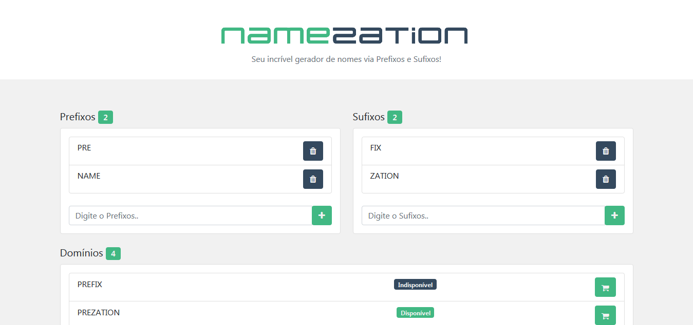

<h1 align="center" id="title">NameZation</h1>
<!-- Logo -->
<p align="center">
  
</p>


<!-- Título&Descrição -->
<h2 align="left" id="descricao">Descrição</h2>
<p align="justify">
  Este é um website bem simples, feito com fins de estudo e aprendizado em Vue.js, gera nomes por meio de prefixos e sufixos inseridos pelo próprio usuário, também a   possibilidade de checar a disponibilidade no <a href="https://registro.br/">registro.br</a> de cada domínio/nome, vale citar que já consta se o endereço é
  disponível para aquisição ou não.
</p>


<!-- Shields -->
<p>
	</img>
  </img>
    </img>
    </img>
    <!-- </img> -->
</p>


<!-- Screenshots -->
<h2 align="left" id="screenshots">Screenshots</h2>
<p align="center">
  
</p>


<!-- Pré-Requisitos -->
<h2 align="left" id="pre">Pré-Requisitos</h2>

Antes de iniciarmos, você vai precisar ter instalado em sua máquina as seguintes ferramentas:

- [Vue](https://vuejs.org/)
- [Node](https://nodejs.org/en/)
- [PostgreSQL](https://www.postgresql.org/download/)

Também facilita muito você possuir um editor para trabalhar com o código, fica a dica o [VSCode](https://code.visualstudio.com/).


<!-- Features -->
<h2 align="left" id="features">Funcionalidades</h2>

- [x] Cadastro de Prefixo e Sufixo;
- [x] Gerador de nomes com base nos Prefixos e Sufixos;
- [x] Verificar a disponibilidade do domínio no site [registro.br](https://registro.br/);


<!-- Executando o app -->
<h2 align="left" id="run">Rodando o website</h2>

```bash
# Clone este repositório
$ git clone https://github.com/IN0C3NC10/NameZation.git

# Abra a pasta no seu VSCode ou editor de preferência

# Instale os pacotes necessários p/ execução com
$ npm install

# Antes de tudo, pegue o script sql em database e crie sua tabela

# Depois, crie um arquivo ".env" no server e preencha com suas informações, com base no ".env-example"

# Sensacional, agora precisaremos de 2 terminais

# Primeiramente o server (backend)
#   Entre na pasta com:
$ cd .\server
#   Em seguida inicie o servidor Node com:
$ node server

# Agora (no 2º terminal) o client (frontend)
#   Entre na pasta com:
$ cd .\client
#   Em seguida execute o projeto Vue com:
$ npm run serve


#BeHappy!
```
<!-- Autor -->
<h2 align="left" id="autor">Autor</h2>
<p>
	<a href="https://github.com/IN0C3NC10">
		
	</a>
	<br />
	Feito com ❤️ por <strong>Bruno Inocencio</strong>!
</p>

<p align="left">
  <!-- Outlook -->
  <a href="mailto:bruno.inocencio@fatec.sp.gov.br" alt="Outlook" target="_blank">
    
  </a>
  <!-- Linkedin -->
  <a href="https://cutt.ly/nQlVjQV" alt="Linkedin" target="_blank">
    
  </a>
  <!-- GitHub -->
  <a href="https://github.com/IN0C3NC10" alt="GitHub" target="_blank">
    
  </a>
</p>
